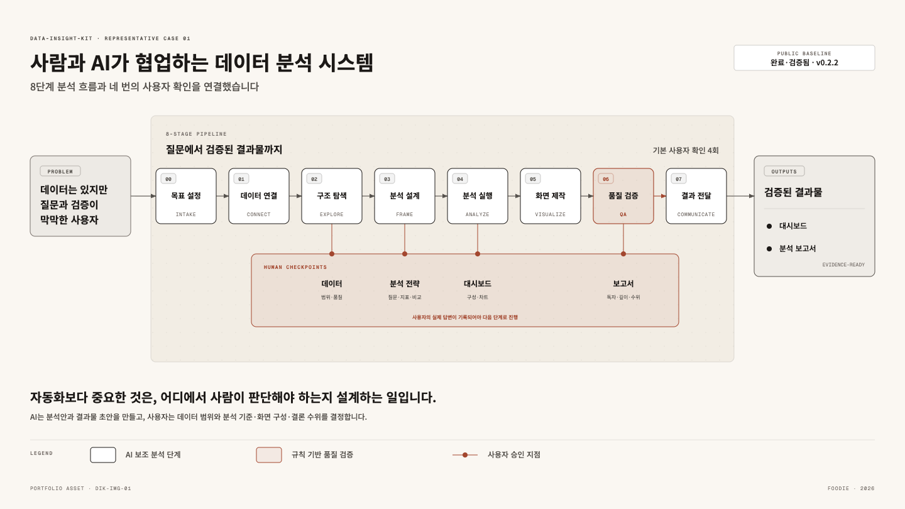
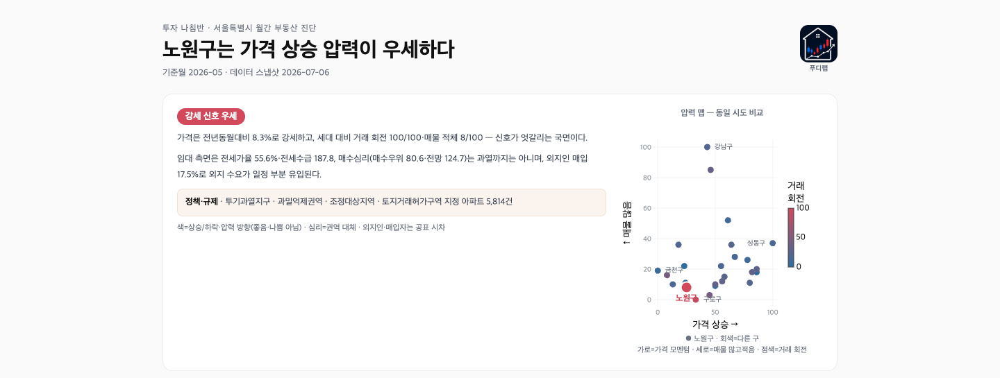
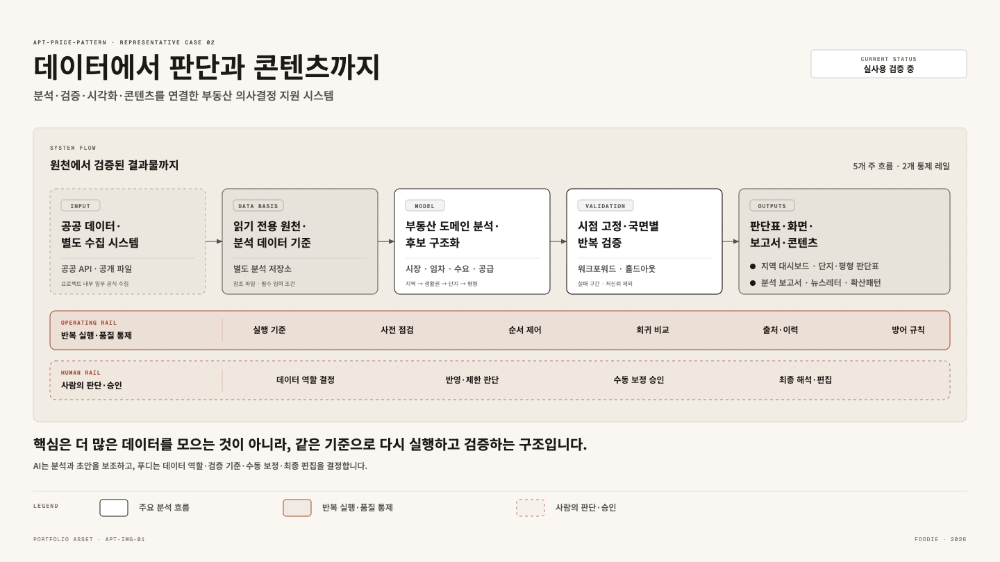
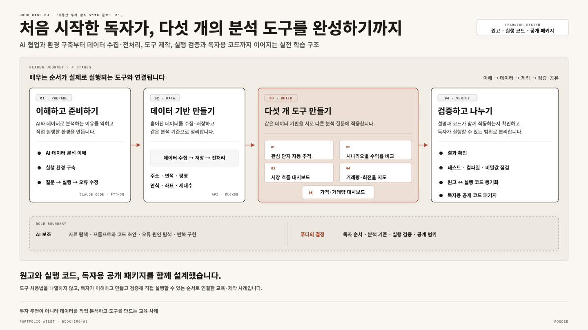

<p align="center">
  
</p>

<p align="center">
  <strong>데이터를 분석해, 사람이 결정할 수 있는 형태로 만듭니다.</strong><br />
  <sub>AI-assisted data analytics · visualization systems · decision tools</sub>
</p>

---

# 실제 문제를 분석하고, 더 나은 의사결정을 돕습니다.

## 안녕하세요. 푸디입니다.

저는 **데이터 분석가**이자, AI와 함께 일하는 분석 워크플로를 설계하는 빌더입니다.
복잡한 데이터를 설명 가능한 분석으로 바꾸고, 그 결과가 보고서·대시보드·학습 도구로
이어지도록 만드는 일을 좋아합니다.

현재는 다음 주제에 집중하고 있습니다.

- **AI 기반 데이터 분석 운영체계** — 질문, 검증, 분석, 시각화, 보고를 하나의 흐름으로 연결합니다.
- **의사결정을 돕는 시각화** — 보기 좋은 차트보다 무엇을 판단해야 하는지가 드러나는 화면을 만듭니다.
- **부동산 데이터 인텔리전스** — 거래·가격·입지 데이터를 재현 가능한 분석 도구로 바꿉니다.
- **주식 데이터 인텔리전스** — 시장·공시·재무 데이터를 근거 중심의 투자 의사결정 도구로 바꿉니다.

## 제가 하는 일

- **프로젝트·컨설팅**<br />
  업무 문제를 진단하고 데이터를 분석해, 더 나은 의사결정을 돕는 프로토타입과 AI·데이터 시스템을 만듭니다.

- **교육·콘텐츠**<br />
  분석과 구현 경험을 강의·책·교육 콘텐츠로 정리해, 다른 사람이 이해하고 직접 활용할 수 있도록 전달합니다.

## 대표 사례

### 1. 사람과 AI가 협업하는 데이터 분석 시스템

- **프로젝트명:** `data-insight-kit`
- **목적:** 데이터는 있지만 질문과 검증이 막막한 사용자가 AI와 함께 분석 방향을 정하고, 검증된 결과를 만들도록 돕습니다.
- **내용:** 데이터 연결부터 결과 전달까지 8단계로 구성하고, 데이터·분석 전략·대시보드·보고서에서 사용자가 확인하도록 설계했습니다.
- **결과:** 사용자 판단을 거친 분석 보고서와 데이터 주입형 대시보드를 재현 가능한 구조로 만듭니다.

<p align="center">
  
</p>

- **역할:** 제품·파이프라인 설계, 사용자 확인 단계와 QA 체계 구현, 공개 배포
- **링크:** [Public 저장소 보기](https://github.com/foodie-repository/data-insight-kit)

### 2. 데이터에서 판단과 콘텐츠까지 연결한 부동산 분석 시스템

- **프로젝트명:** `APT-Price-Pattern`
- **목적:** 흩어진 부동산 데이터를 같은 기준으로 반복 분석해 지역 변화의 이유를 추적하고 판단 근거를 만듭니다.
- **내용:** API·크롤링 기반 데이터 수집, 데이터 계보와 분석 기준, 모델링, 반복 검증, 실행·품질 통제를 대시보드와 콘텐츠까지 연결했습니다.
- **결과:** 지역 대시보드, 분석 보고서, 뉴스레터, 패턴 라이브러리로 활용 범위를 확장했습니다.

<p align="center">
  <strong>실제 지역 대시보드</strong><br />
  <a href="./case-studies/nowon-dashboard.md">
    
  </a><br />
  <sub><a href="./case-studies/nowon-dashboard.md">노원구 대시보드 전체 구성 보기 →</a></sub>
</p>

<details>
  <summary><strong>분석 시스템 구조 보기</strong></summary>
  <br />
  <p align="center">
    <a href="./assets/apt-price-pattern.png">
      
    </a>
  </p>
</details>

- **역할:** 데이터 수집·계보, 분석 기준, 모델링, 검증 구조와 실행 하네스 설계
- **확장:** 파일럿을 같은 구조로 확장해 지역 차이와 한계를 반복 검증

_비식별 상세 사례는 공개 범위를 정리한 뒤 연결할 예정입니다._

### 3. AI 분석 경험을 책과 실행 코드로 완성

- **도서명:** 『부동산 투자 분석 with 클로드 코드』
- **형태:** 종이책
- **출판 정보:** 한빛미디어 · 2026년 9월 출간 예정
- **목적:** 코딩 경험이 적은 독자도 Claude Code와 함께 부동산 데이터를 분석하고 직접 도구를 완성하도록 돕습니다.
- **내용:** 데이터 수집·전처리부터 다섯 개 분석 도구와 대시보드 제작까지 단계적으로 구성했습니다.
- **결과:** 원고·실행 코드·독자용 공개 패키지를 함께 구성했습니다.

<p align="center">
  
</p>

- **역할:** 책 기획·집필, 독자 경험, 실습 코드와 대시보드 설계
- **링크:** [독자용 코드 저장소](https://github.com/foodie-repository/real-estate-investment-analysis-with-claude-code)

## 주식 데이터 분석·시각화

### 주식 시장 데이터를 한 화면에서 비교하는 분석 대시보드

- **프로젝트명:** `ai-market-report`
- **목적:** ETF·종목 데이터를 한 화면에서 비교해 시장 판단에 필요한 근거를 정리합니다.
- **내용:** 시장·섹터·가격 흐름·거시·심리·밸류에이션·실적을 정해진 데이터 구조로 연결했습니다.
- **결과:** 여러 관점을 함께 비교할 수 있는 ECharts 대시보드를 만들었습니다.

- **공개 경계:** 개인 투자정보와 자동 매매 지시는 공개 범위에서 제외했습니다. 근거와 위험 조건을 함께 살피는 검토 도구만 소개합니다.

## 공개 프로젝트

| 프로젝트 | 무엇을 해결하나요? |
|---|---|
| **[data-insight-kit](https://github.com/foodie-repository/data-insight-kit)** | 표 데이터를 받아 분석 보고서와 데이터 주입형 대시보드까지 만드는 체크포인트 기반 분석 키트입니다. |
| **[Nonparametric-Analysis](https://github.com/foodie-repository/Nonparametric-Analysis)** | 17종 비모수 통계 분석을 실행하고, 결과 해석과 시각화까지 연결하는 실무 가이드입니다. |
| **[real-estate-investment-analysis-with-claude-code](https://github.com/foodie-repository/real-estate-investment-analysis-with-claude-code)** | 『부동산 투자 분석 with 클로드 코드』 독자를 위한 수집·분석·대시보드 예제입니다. |
| **[da-viz-converter](https://github.com/foodie-repository/da-viz-converter)** | Codex의 데이터 분석·시각화 워크플로를 Claude Code 환경에서 재현하기 위한 검증형 컨버터입니다. |

## 일하는 방식

```text
문제 진단 → 분석·프로토타입 → 실행 검증 → 시스템·전달
```

문제를 이해하고 판단에 필요한 결과를 만듭니다. 결과는 다시 쓸 수 있는 구조로 정리해 전달합니다.

### 분석 작업의 세부 흐름

```text
질문 정의 → 근거 확인 → 분석 설계 → 사용자 확인 → 시각화 → 재현 가능한 결과물
```

- **Evidence first** — 결론보다 원천 데이터와 검증 가능한 근거를 먼저 봅니다.
- **Human checkpoints** — 중요한 판단은 자동으로 넘기지 않고 사람이 확인할 수 있게 만듭니다.
- **Reproducible by default** — 같은 입력과 조건이면 같은 결과를 다시 만들 수 있어야 합니다.
- **Documentation as product** — 문서는 부록이 아니라 사용자가 실제로 일을 끝내게 하는 인터페이스입니다.

## 교육·커뮤니티

### GPTers AI·데이터 스터디장(기획·운영), GPTers 파트너스

[GPTers](https://www.gpters.org/)는 AI 도구의 실제 활용 사례를 공유하고 함께 배우는 국내 최대 AI 커뮤니티입니다.

총 4개 기수에서 스터디장(기획·운영)을 맡고 GPTers 파트너스로 활동하고 있습니다. 참여자가 직접 결과를 만들고 확인할 수 있도록 커리큘럼·세션·실습 자료와 운영 흐름을 설계했습니다.

- **15기 태블로 스터디:** 태블로 기반 데이터 시각화 대시보드 제작
- **20·21기 ChatAPT:** 부동산 AI 분석 워크스페이스 설계 및 AI Agent 개발
- **23기 데이터 분석·시각화:** 데이터 수집, 부동산·주식 대시보드, 재사용 가능한 대시보드 템플릿

## 기술 기반과 구현 방식

`Python · SQL · DuckDB`로 데이터 수집과 분석 기반을 만들고, `HTML · CSS · JavaScript · React · Next.js`로 복잡한 분석 결과를 읽기 쉬운 대시보드와 시각화로 구현합니다. `Claude Code · Codex`를 분석·개발 워크플로에 활용하고, 자동 테스트·화면 검증·Git 기록으로 품질과 재현성을 관리합니다.

## 함께 이야기할 수 있는 일

AI·데이터 프로젝트, 분석 시스템, 대시보드, 교육·콘텐츠 협업이 필요하다면 연락 주세요.

**연락처:** [datafoodie@naver.com](mailto:datafoodie@naver.com)

---

<p align="center">
  <sub>좋은 분석은 숫자를 보여주는 데서 끝나지 않고, 다음 행동을 더 분명하게 만듭니다.</sub>
</p>
