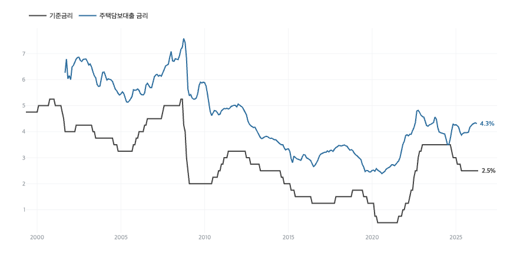
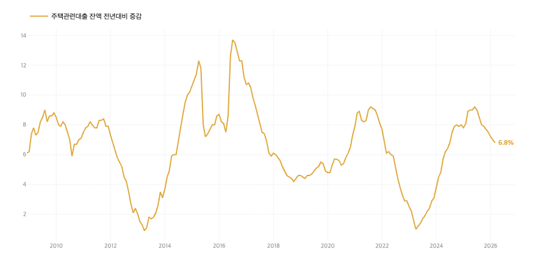
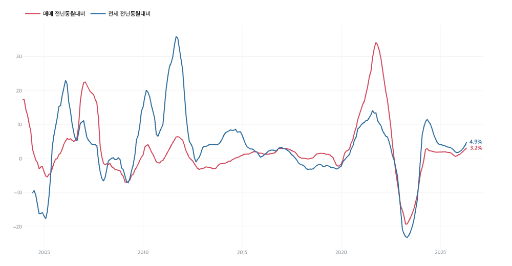
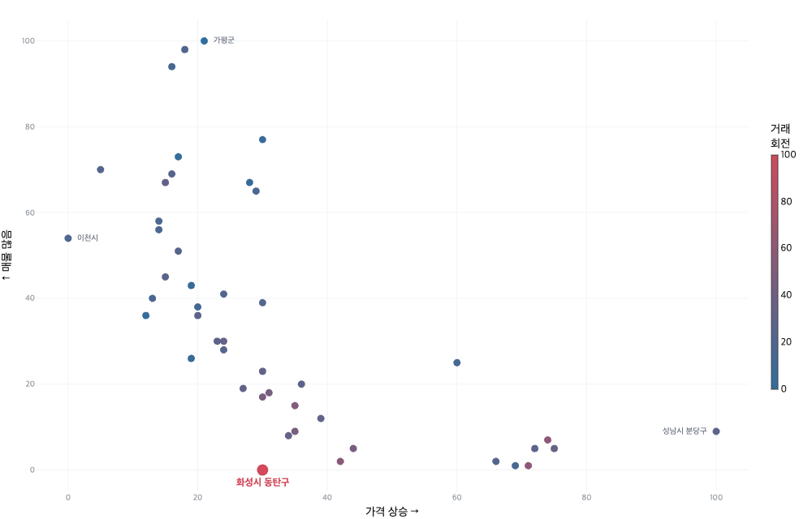
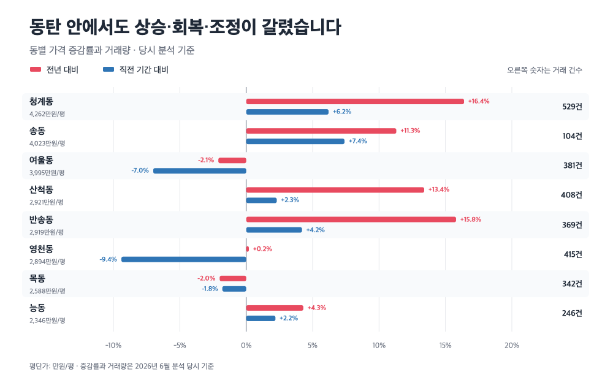
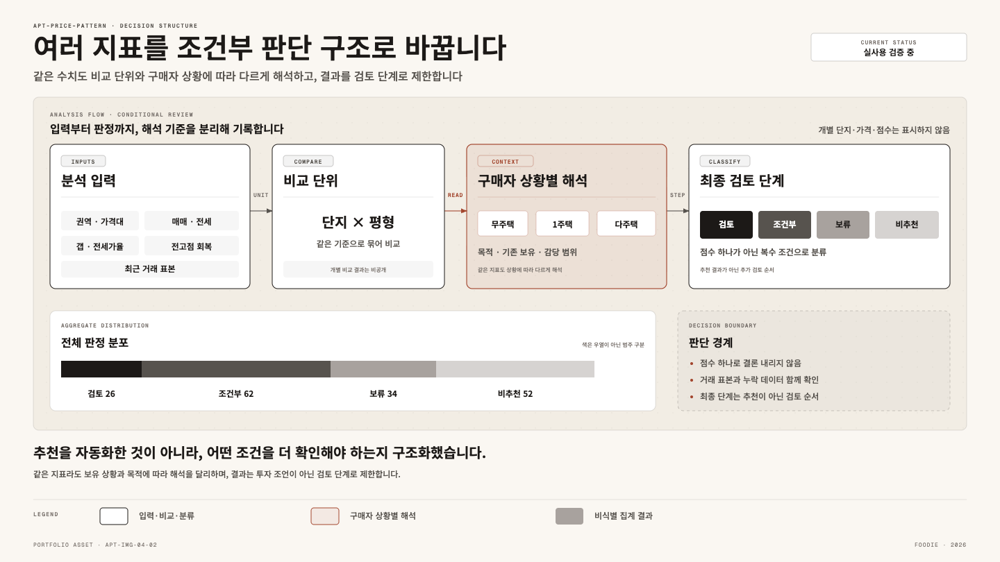
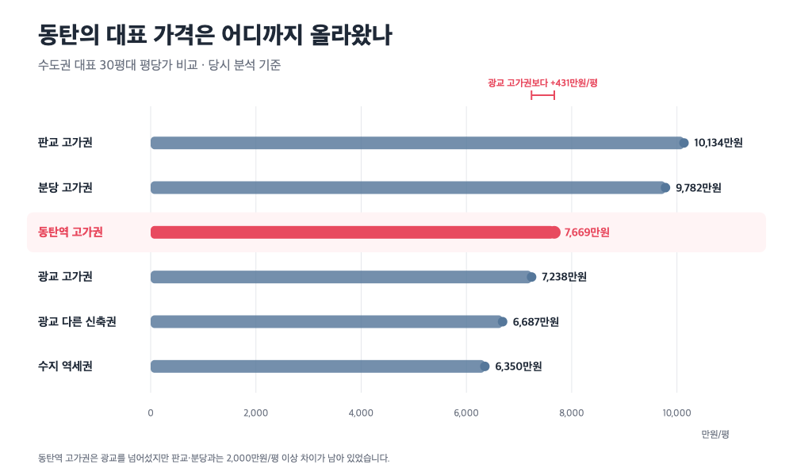

# 지역 데이터를 차트와 보고서로 확장하는 분석 에이전트 시스템 — 동탄구 사례

`APT-Price-Pattern`의 분석 에이전트와 실행 하네스가 승인된 지역 데이터를 검증하고, 공통·지역 특화 차트와 보고서 초안을 만든 뒤 푸디가 수치·논리·표현을 최종 검토한 사례입니다.

[← 푸디 프로필로 돌아가기](../README.md)

> 이 글은 2026년 6월 동탄구 시장 분석을 바탕으로 원천 데이터를 재검증하고, 당시 분석의 수치와 표현을 보정한 포트폴리오용 편집본입니다.

## 에이전트 시스템의 작동 방식

이 사례에서 AI의 역할은 문장 생성에 한정되지 않습니다. 분석 에이전트는 승인된 데이터와 실행 기준 안에서 비교 단위를 정리하고, 계산·차트·보고서 초안을 같은 흐름으로 연결합니다. 실행 하네스는 입력 시점과 분석 순서, 검증과 산출물 기준을 고정하고, 푸디는 지표의 역할과 최종 해석·공개 범위를 결정합니다.

<p align="center">
  <a href="../assets/apt-price-pattern.png">
    
  </a><br />
  <sub>같은 분석 기반을 판단표·대시보드·차트·보고서로 확장하는 시스템 구조</sub>
</p>

```text
승인된 원천·참조 데이터 → 실행 기준과 사전 점검
→ 지역·생활권·단지·평형 분석 → 공통·지역 특화 차트
→ 보고서 초안 → 사람의 수치·논리·표현 검토 → 공개 결과
```

| 분석 단계 | 동탄구 사례에서 만든 결과 |
|---|---|
| 공통 분석 | 금리·가계대출, 매매·전세 가격 흐름, 경기도 내 시장 위치 |
| 지역 특화 분석 | 동탄 내부의 상승·회복·조정 구간, 광교·판교·분당과의 가격 관계 |
| 상세 검토 | 174개 단지·평형을 가격·전세·전고점·거래 표본과 구매자 상황별로 구조화 |
| 결과 전달 | 분석 차트 6개, 비식별 판단 구조, 장문 분석 리포트 |

노원구 사례와 같은 유형의 차트는 중복 자료가 아니라 같은 분석 기준을 다른 지역에 반복 적용할 수 있다는 증거입니다. 그 위에 동탄 내부 차이와 상급지 가격 관계를 지역 특화 분석으로 추가해, 표준화와 도메인 해석을 함께 보여줍니다.

## 결과물 개요

- **프로젝트:** `APT-Price-Pattern`
- **분석 대상:** 2026년 6월 당시 동탄구 아파트 시장
- **목적:** 지역의 가격·거래·전세 흐름을 하나의 원인으로 단순화하지 않고, 상승 동력과 위험 요인, 지역 안의 차이를 함께 설명
- **결과:** 거시·시장·생활권·상급지 비교 차트 6개, 174개 단지·평형 검토 구조와 장문 분석 리포트
- **역할:** 분석 질문과 데이터 기준 설정, 판단 구조 설계, 수치 재검증, AI 초안의 논리·표현 편집

## 한눈에 보는 결론

- 동탄구의 상승은 GTX-A 하나가 아니라 **규제 차이·반도체 배후수요·고소득 실수요의 구매력·교통 개선**이 겹친 결과로 해석했습니다.
- 원천 거래 데이터를 다시 확인한 결과, 매매 거래량은 **2026년 5월 1,355건**, **6월 19일까지 1,007건**이었습니다. 거래는 활발했지만 **전세가율 58.8%** — 경기 안에서는 낮은 편이었습니다.
- 동탄역 인접 고가권, 가격 상승이 번지는 회복권, 최근 약세를 보인 지역을 같은 결론으로 묶지 않았습니다.
- 단지와 평형까지 내려갈 때는 가격대·전세가율·전고점 회복 정도·최근 거래 표본을 함께 보고, 결과를 자동 추천이 아닌 **추가 검토 순서**로 제한했습니다.

---

## 분석 리포트

아래 본문은 시스템 설명을 위해 줄인 요약이 아니라, 에이전트와 하네스가 만든 차트와 분석 초안을 사람이 검토해 완성한 실제 장문 결과물입니다.

### 1. 거래는 뜨거운데 전세가율은 낮았습니다

2026년 6월 당시 기준금리는 2.5%, 주택담보대출 금리는 4.31%였습니다. 같은 거시 환경에서도 강남·노원·동탄은 서로 다른 움직임을 보였습니다. 금리 하나만으로 지역 시장을 설명할 수 없다는 뜻입니다.

**공통 분석 차트.** 금리와 대출, 매매와 전세의 장기 흐름은 지역이 바뀌어도 같은 기준으로 생성해 현재 국면을 확인합니다.

<p align="center">
  <a href="../assets/dongtan-macro-rates.png">
    
  </a>
  <a href="../assets/dongtan-household-loan.png">
    
  </a><br />
  <sub>기준금리·주택담보대출 금리와 가계대출 증가율</sub>
</p>

동탄구의 지표를 모아 보면 ‘활발한 거래’와 ‘낮은 전세가율’이라는 두 신호가 동시에 나타납니다.

| 지표 | 값 | 해석 |
|---|---:|---|
| 매매 거래량 | 2026년 5월 **1,355건** / 6월 19일까지 **1,007건** | 거래 회전이 경기 최상위권 |
| 매물 적체 | 경기 최저권 | 거래에 비해 매물이 적게 쌓임 |
| 전세가율 | **58.8%** | 경기 안에서 낮은 축 |
| 실거래 중위가 | 5월 **7.55억** / 6월 19일까지 **7.40억** | 전세 중위값은 4.00~4.15억 수준 |
| 매매·전세 상승률 | +3.2% / **+4.9%** | 화성시 전체 기준, 전세가 더 빠르게 상승 |

전세 매물이 부족해 전세가격이 오르는 것과 전세가격이 매매가격을 안정적으로 받치는 것은 다른 이야기입니다. 당시 전세가격 상승률은 매매보다 높았지만, 전세가율 자체는 58.8%로 낮았습니다. 거래량만 보면 강한 시장이지만 매매와 전세의 간격까지 함께 보면 미래 기대가 가격에 많이 반영된 시장으로 읽을 수 있었습니다.

<p align="center">
  <a href="../assets/dongtan-price-trend.png">
    
  </a><br />
  <sub>화성시 매매·전세가격의 전년 동월 대비 증감률</sub>
</p>

### 2. 상승을 GTX 하나로 설명하지 않았습니다

동탄구의 상승에는 네 가지 동력이 같은 시기에 겹쳤습니다.

**규제 차이.** 당시 수도권 여러 지역이 규제로 묶인 가운데 동탄은 상대적으로 규제에서 비껴 있었습니다. ‘비규제·고소득 직주근접’이라는 조합이 부각되면서 수요가 유입됐습니다.

**반도체 배후수요.** 동탄은 화성·평택·용인·이천의 반도체 산업축과 연결된 주거지입니다. 주변 산업단지 증설 계획과 고소득 종사자의 직주근접 수요가 중장기 수요의 근거가 됐습니다.

**구매력을 갖춘 실수요.** 산업 호황과 성과급, 금융자산 수익이 주택 구매력으로 이어졌습니다. 가격을 움직인 수요를 단순한 투자 수요로만 보지 않고, 지역 산업과 소득 기반까지 함께 살폈습니다.

**GTX-A.** 서울 접근성이 개선되며 동탄역 인접 신축에 프리미엄이 붙었습니다. 다만 교통 호재만으로는 당시의 거래량과 상승 속도를 모두 설명하기 어려웠습니다.

이 네 가지는 따로 작동하지 않았습니다. 산업이 소득과 배후수요를 만들고, 규제 차이가 자금의 이동을 열어 주며, 교통 개선이 정주 여건과 가격 기대를 높였습니다. 상승 동력이 여러 개라는 점은 힘을 설명하지만, 정책·금리·산업 경기 중 하나가 달라져도 시장 반응이 달라질 수 있다는 뜻이기도 합니다.

| 동력 | 수요와 가격에 연결되는 경로 | 다시 확인할 조건 |
|---|---|---|
| 규제 차이 | 다른 수도권 지역과의 거래 조건 차이 → 수요 이동 | 규제 지정과 거래 구조 변화 |
| 반도체 산업 | 기업 투자·고용 → 직주근접 배후수요 | 투자 일정과 산업 경기 |
| 구매력 | 소득·성과급·금융자산 → 실수요자의 자금 여력 | 금리와 대출 여건 |
| GTX-A | 서울 접근성 개선 → 역세권 신축 선호 | 이용 편의와 가격 선반영 정도 |

호재를 나열하는 대신 각 요인이 어떤 경로로 수요와 가격에 연결되는지, 그 경로가 약해질 조건은 무엇인지까지 붙였습니다. 이렇게 해야 새로운 데이터가 들어왔을 때 기존 결론을 그대로 반복하지 않고 분석을 다시 실행할 수 있습니다.

### 3. 경기도 안에서 동탄구의 위치를 비교했습니다

지역 지표는 숫자 하나보다 상대적 위치에서 의미가 분명해집니다. 경기도 47개 시·군·구를 가격·거래·전세·매물·미분양·입주 지표로 비교해 동탄구가 어느 축에 놓이는지 확인했습니다.

- **거래:** 동탄구는 경기에서 거래가 가장 활발한 축에 속했습니다.
- **매물:** 거래에 비해 매물이 적게 쌓여 수요 우위의 모습이 나타났습니다.
- **전세가율:** 경기 외곽의 실거주 시장보다 낮았습니다. 매매가격에 미래 기대가 더 많이 반영됐다는 신호로 봤습니다.
- **공급:** 강남·노원과 달리 예정된 입주 물량이 있어 수요뿐 아니라 공급 시점도 함께 확인해야 했습니다.

이 시장 압력 지도도 공통 분석에 속합니다. 같은 축으로 여러 지역을 비교하되, 동탄구가 놓인 위치를 다음 심층 분석의 출발점으로 사용했습니다.

<p align="center">
  <a href="../assets/dongtan-market-pressure.png">
    
  </a><br />
  <sub>가격 상승·매물 적체·거래 회전을 한 화면에서 비교한 시장 압력 지도</sub>
</p>

동탄구는 가격 상승이 강하면서 매물은 적고 거래 회전은 높은 자리에 놓였습니다. ‘팔 사람은 적은데 살 사람은 많은’ 수급 구도입니다. 다음 질문은 상승 여부가 아니라, 이 힘이 가격에 얼마나 반영됐는가였습니다.

### 4. 비슷한 지역과 대조적인 지역을 함께 봤습니다

동탄구의 시장 성격을 더 분명하게 보기 위해 다섯 개 지표를 백분위로 바꾸고, 가장 닮은 지역과 가장 대조적인 지역을 함께 비교했습니다.

거래 회전과 가격 상승이 함께 높은 지역은 동탄과 비슷한 모양을 보였습니다. 반대로 전세가율은 높지만 가격 동력이 약한 외곽 실거주 지역은 정반대 모양이었습니다.

| 비교 유형 | 가격 동력 | 거래 회전 | 전세가율 | 읽은 시장 성격 |
|---|---|---|---|---|
| 동탄구 | 높음 | 매우 높음 | 낮음 | 기대와 수요가 함께 끄는 시장 |
| 유사 지역 | 높음 | 높음 | 중간 | 거래가 활발한 신축·역세권 시장 |
| 대조 지역 | 낮음 | 낮음 | 높음 | 전세가 매매가에 가까운 외곽 실거주 시장 |

이 비교에서 동탄의 양면성이 드러났습니다. 거래가 활발해 가격을 밀어 올리는 힘은 강했지만, 전세가율이 낮아 기대가 흔들릴 때 가격을 받칠 완충은 상대적으로 얇았습니다. 강한 상승 동력과 기대 변화에 대한 민감도가 함께 있는 시장이었습니다.

### 5. 동탄 안에서도 흐름이 갈렸습니다

‘동탄’이라는 이름으로 지역 전체를 묶으면 내부 차이를 놓치게 됩니다. 동탄역 인접 고가권, 호수권 신축, 동탄1 회복권, 최근 약세 지역이 서로 다른 흐름을 보였습니다.

평단가는 만원/평, 증감률은 당시 분석 기준입니다.

| 지역 | 평단가 | 전년 | 전기 | 거래 | 특징 |
|---|---:|---:|---:|---:|---|
| 청계동 | 4,262 | **+16.4%** | +6.2% | 529건 | 동탄역세권 고가·거래 중심 |
| 송동 | 4,023 | +11.3% | +7.4% | 104건 | 호수권 신축 |
| 여울동 | 3,995 | **−2.1%** | −7.0% | 381건 | 고가권이지만 최근 약세 |
| 산척동 | 2,921 | +13.4% | +2.3% | 408건 | 신축 입주권 상승 |
| 반송동 | 2,919 | +15.8% | +4.2% | 369건 | 동탄1 회복권 |
| 영천동 | 2,894 | +0.2% | **−9.4%** | 415건 | 역 인접 지역 안의 조정 |
| 목동 | 2,588 | −2.0% | −1.8% | 342건 | 최근 약세 |
| 능동 | 2,346 | +4.3% | +2.2% | 246건 | 동탄1 상대적 저가권 |

청계동은 가격과 거래를 함께 끌었지만, 같은 고가권인 여울동이나 역 인접 지역인 영천동에서는 약세가 나타났습니다. “동탄은 모두 오른다”와 “동탄역만 오른다”는 설명 모두 충분하지 않았습니다. 가격대와 시점, 거래 표본을 나눠 봐야 실제 흐름이 보였습니다.

<p align="center">
  <a href="../assets/dongtan-submarket-divergence.png">
    
  </a><br />
  <sub>동탄 내부 가격 흐름의 분화 — 공통 지역 분석 뒤에 추가한 지역 특화 차트</sub>
</p>

### 6. 174개 단지·평형을 같은 기준으로 검토했습니다

지역과 생활권 분석을 단지·평형 단위까지 확장했습니다. 174개 비교 행에 최근 매매·전세가격, 갭과 전세가율, 전고점 회복 정도, 최근 거래 표본을 연결하고 구매자 상황에 따라 해석 순서를 달리했습니다.

<p align="center">
  <a href="../assets/dongtan-review-structure.png">
    
  </a><br />
  <sub>가격 하나가 아니라 여러 지표와 구매자 상황을 연결한 검토 구조</sub>
</p>

분류 결과는 검토 26개, 조건부 62개, 보류 34개, 비추천 52개였습니다. 이 범주는 공개 투자 신호가 아니라 분석 과정에서 무엇을 먼저 확인할지 정하는 검토 순서입니다.

분석의 핵심은 가격대와 전세가율의 조합이었습니다. 입지가 강한 고가 단지는 시장의 방향을 보여주지만, 전세 완충과 전고점 회복 정도를 함께 보면 진입 부담이 달라집니다. 반대로 상대적 저가권이라도 최근 거래가 부족하거나 약세 원인이 확인되지 않으면 같은 결론을 낼 수 없습니다.

검토는 다음 순서로 진행했습니다.

1. **가격대 확인:** 같은 지역에서도 구매자가 실제로 비교할 수 있는 가격 구간을 먼저 나눴습니다.
2. **매매·전세 관계 확인:** 갭과 전세가율을 함께 보고 가격을 받치는 힘을 살폈습니다.
3. **전고점과 현재 위치 확인:** 신고가권인지, 회복 중인지, 아직 약세인지 구분했습니다.
4. **거래 표본 확인:** 최근 거래가 충분하지 않으면 수치가 좋아 보여도 판단을 보류했습니다.
5. **구매자 상황별 질문 연결:** 무주택·1주택·다주택의 제약이 다르므로 같은 단지에도 다른 확인 질문을 붙였습니다.

무주택자에게는 정주 여건과 자금 부담, 1주택자에게는 기존 주택과의 가격 차이와 이동 목적, 다주택자에게는 정책 변화와 임대·매도 경로가 핵심 질문이 됐습니다. 같은 점수로 모두에게 같은 답을 내리지 않도록 사람의 판단 지점을 남긴 이유입니다.

### 7. 대장 단지는 지역 간 가격 관계로 해석했습니다

2026년 6월 당시 동탄역 인접 대표 신축의 전용 84㎡ 실거래가는 22.25억 원까지 올라왔습니다. 2025년 4월 16.2억 원에서 약 14개월 만에 37.4% 상승한 수준이었습니다.

| 시점 | 동탄역 인접 대표 신축 전용 84㎡ 최고 실거래가 |
|---|---:|
| 2025년 4월 | 16.2억 |
| 2025년 12월 | 18.0억 |
| 2026년 2월 | 19.0억 |
| 2026년 4월 | 19.4억 |
| 2026년 5월 | 20.8억 |
| 2026년 6월 | **22.25억** |

단순히 신고가로 끝내지 않고 광교·판교·분당의 대표 가격대와 비교했습니다. 동탄의 대표 신축은 평당가 기준으로 광교 고가권을 넘어섰지만, 판교·분당과는 여전히 평당 2,000만 원 이상 차이가 있었습니다.

| 비교 권역 | 대표 30평대 평당가 | 동탄과의 관계 |
|---|---:|---|
| 동탄역 고가권 | **7,669만원** | 비교 기준 |
| 광교 고가권 | 7,238만원 | 동탄이 추월 |
| 광교 다른 신축권 | 6,687만원 | 동탄보다 낮음 |
| 수지 역세권 | 6,350만원 | 동탄보다 낮음 |
| 판교 고가권 | 10,134만원 | 동탄보다 2,000만원 이상 높음 |
| 분당 고가권 | 9,782만원 | 동탄보다 2,000만원 이상 높음 |

<p align="center">
  <a href="../assets/dongtan-upper-market-gap.png">
    
  </a><br />
  <sub>동탄역 고가권의 위상 변화와 상급지 사이의 가격 차이를 함께 본 지역 특화 차트</sub>
</p>

여기서 두 방향이 동시에 보였습니다. 광교와의 가격 관계가 바뀌었다는 것은 동탄의 위상이 높아졌다는 신호였습니다. 반면 상급지와의 가격 차이가 줄어들수록 동탄 안에서 더 높은 가격을 지불할지, 판교·분당으로 이동할지를 비교하는 수요가 늘어날 수 있습니다. 신고가는 상승의 증거인 동시에 다음 가격대에서의 저항을 확인해야 하는 지점이었습니다.

### 8. 당시 정책 변수는 사실과 해석을 나눴습니다

분석 기준일인 2026년 6월 19일 당시 화성시의 조정대상지역·투기과열지구·투기지역·토지거래허가구역 적용값은 모두 0이었습니다. 동시에 동탄구는 가격 상승 속도와 행정 검토 흐름 때문에 규제 가능성이 거론되던 시점이었습니다.

따라서 ‘현재 규제지역’이라는 사실과 ‘지정 가능성이 높아졌다’는 해석을 분리했습니다. 정책 변화가 현실화되면 거래, 대출, 임대 공급에 서로 다른 영향을 줄 수 있기 때문입니다. 특히 비규제라는 조건이 상승 동력 중 하나였다면 규제 변화는 같은 경로를 반대로 움직이는 변수가 됩니다.

| 변화 경로 | 시장에서 확인할 반응 |
|---|---|
| 거래 조건 강화 | 투자 수요 감소, 거래량과 매물 변화 |
| 대출 조건 강화 | 가격대별 자금 부담과 수요층 변화 |
| 실거주 요건 강화 | 임대 물량과 전세가격 변화 |
| 세제 변화 | 보유·매도 의사와 매물 출회 변화 |

이 부분은 특정 정책을 예측하려는 문장이 아니라, 분석 시점을 고정하고 정책 상태가 달라질 때 어떤 지표를 다시 확인해야 하는지 정리한 것입니다.

### 9. 단기와 중장기 흐름을 나눠 봤습니다

**단기에는 정책과 가격 저항을 봤습니다.** 규제 가능성이 커지거나 거래 조건이 바뀌면 가장 먼저 거래량과 매물 구조에 반응이 나타날 수 있습니다. 동탄역 고가권이 광교를 넘어 판교·분당 가격대에 가까워진 점도 이전과 다른 저항을 만들 수 있었습니다. 상승세가 이어지는지보다, 높은 가격에서도 실제 거래가 이어지는지가 더 중요한 확인 항목이었습니다.

**중장기에는 산업 배후수요를 봤습니다.** 화성·평택·용인·이천의 반도체 산업축과 직주근접 수요는 단기 정책만으로 사라지는 성격이 아니었습니다. GTX-A가 만든 접근성과 신도시의 정주 여건도 이 수요를 뒷받침했습니다.

**공급과 금리는 두 시간축 모두에 영향을 줬습니다.** 당시 향후 1년 입주 예정 물량은 1,909세대였고 추가 공급 계획도 있었습니다. 입주가 몰리는 시점에는 전세와 매매가 함께 영향을 받을 수 있습니다. 전세가율이 낮고 매매·전세 간격이 큰 시장에서는 금리 변화도 더 민감하게 작용합니다.

따라서 당시의 동탄은 ‘계속 오른다’거나 ‘곧 꺾인다’는 한 문장보다, **단기에는 정책·가격 저항을 확인하고 중장기에는 산업 수요·공급·금리를 함께 추적해야 하는 시장**으로 정리했습니다.

### 10. 결론보다 다시 확인할 조건을 남겼습니다

당시 동탄구를 받쳐 준 신호는 세 가지였습니다.

- 경기 최상위권의 거래 회전과 낮은 매물 적체
- 반도체 산업축과 연결된 직주근접 배후수요
- 동탄역 대표 신축의 가격 상승과 지역 위상 변화

반대로 시장의 해석을 바꿀 수 있는 변수도 세 가지였습니다.

- 규제 상태와 거래 구조의 변화
- 상급지와의 가격 차이가 좁혀질 때 나타나는 수요 이동
- 예정된 입주 물량과 금리 변화

동탄 안에서도 고가권·회복권·약세 지역의 흐름이 갈렸기 때문에 지역 평균만으로 하나의 결론을 내리지 않았습니다. 다음 분석에서는 정책 상태, 대장 단지 거래, 월간 거래 속도, 상급지 동반 움직임, 입주 시점을 다시 확인하도록 체크포인트를 남겼습니다.

1. 규제지역·토지거래허가구역 지정 여부
2. 동탄역 인접 고가권의 거래와 가격 흐름
3. 6월 거래량이 5월 1,355건의 속도를 이어가는지
4. 분당·수지·영통 등 상급지의 동반 움직임
5. 향후 입주 물량의 실제 시점과 전세시장 반응

---

## 에이전트 시스템이 결과물을 만드는 과정

```text
입력 시점과 데이터 역할 고정 → 원천 수치 재검증
→ 지역·생활권·단지·평형 분석 → 공통 차트 생성
→ 지역 특화 차트와 판단 구조 생성 → AI 보고서 초안
→ 사람의 수치·논리·표현 검토 → 독자용 분석 리포트
```

같은 조건으로 다시 실행하거나 지역과 기준월을 바꾸어도 공통 분석을 같은 규격으로 반복하고, 지역 데이터에서 드러난 차이에 맞춰 심층 차트와 보고서 구조를 확장할 수 있도록 설계했습니다. 공통 차트의 반복은 결과를 복사한 것이 아니라 분석 기준의 일관성을 보여주며, 지역 특화 차트는 에이전트 시스템이 하나의 고정 템플릿에 머물지 않는다는 증거입니다.

AI가 문장을 생성하는 것만으로는 신뢰할 수 있는 분석 글이 완성되지 않습니다. 초안에 사용된 거래량의 월·부분월 기준을 다시 나누고, 사실과 해석을 구분했으며, 강한 예측이나 직접적인 행동 표현은 추가 확인이 필요한 조건으로 조정했습니다.

## 분석 에이전트·실행 하네스와 푸디의 역할

- **분석 에이전트:** 승인된 데이터와 기준 안에서 계산·비교를 수행하고, 공통·지역 특화 차트와 시장 서사·분석 문장의 초안을 작성
- **실행 하네스:** 입력 시점, 분석 순서, 필수 점검, 산출물과 검증 기준을 고정해 같은 흐름을 다시 실행할 수 있도록 관리
- **푸디:** 분석 질문과 지표의 역할을 결정하고, 원천 수치·시점·논리를 재검증하며 차트 선택, 독자 흐름과 표현 수위를 최종 승인

핵심은 AI가 글을 대신 썼다는 데 있지 않습니다. 데이터에서 차트와 보고서까지 이어지는 작업을 반복 가능한 시스템으로 만들고, 사람이 분석 기준과 해석을 끝까지 책임지도록 설계했다는 데 있습니다.

## 데이터 기준

- 분석 기준 시점: 2026년 6월 19일
- 거래량 재검증: 2026년 5월 1,355건, 2026년 6월 19일까지 1,007건
- 지역 전세가율: 58.8%
- 주요 데이터: 국토교통부 아파트 실거래가, KOSIS, 한국은행, 가격·심리·공급 지표와 정책 자료
- 정책 관련 서술은 2026년 6월 당시의 분석 맥락을 보여주는 기록이며, 현재 시장 판단으로 사용하지 않습니다.
