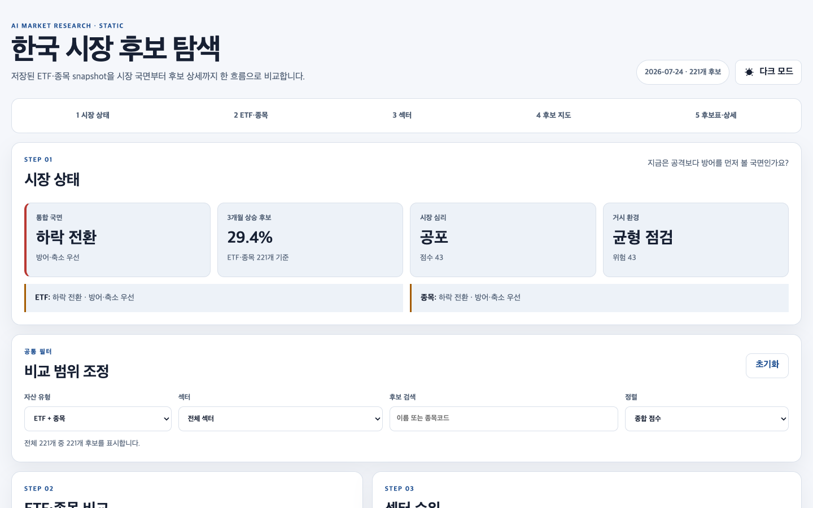
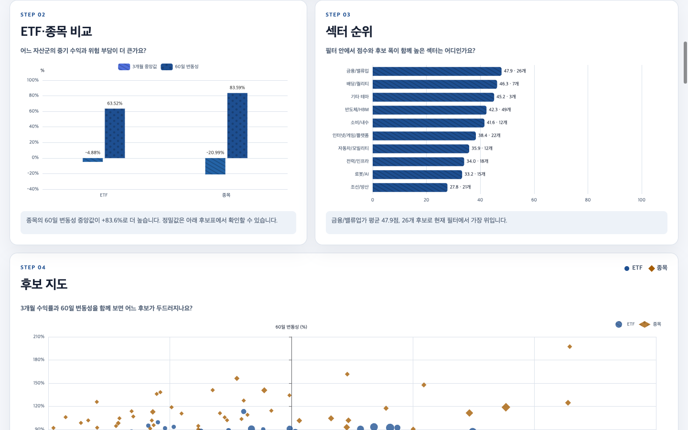
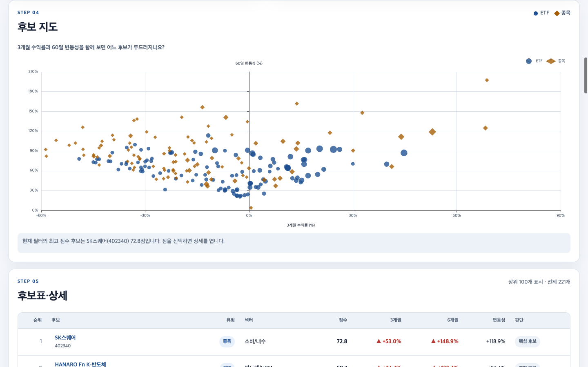
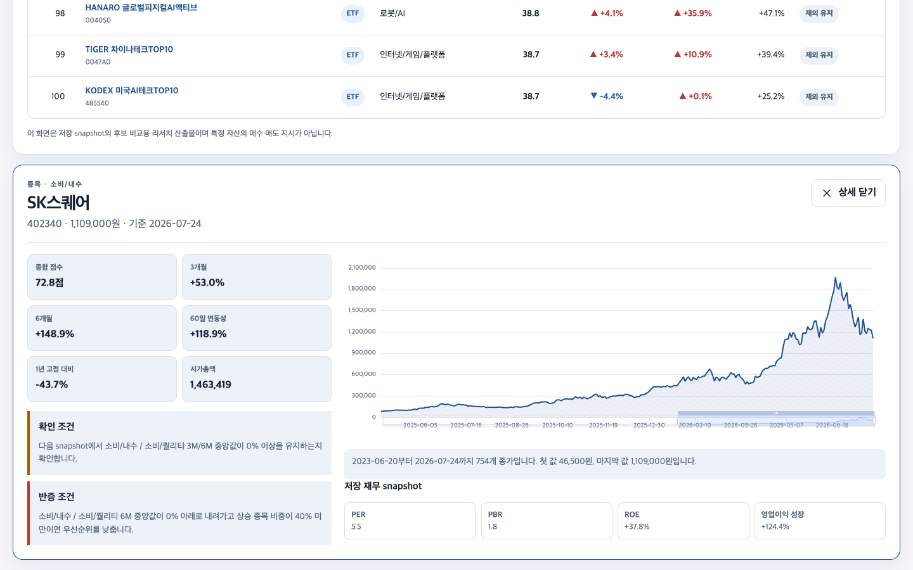

# 시장 데이터를 판단 근거로 연결하는 주식 분석 대시보드

시장 국면, ETF·종목, 섹터, 가격 흐름, 거시·심리, 재무 근거를 하나의 비교 흐름으로 연결한 `ai-market-report`의 공유 현황판입니다.

이 사례는 특정 종목을 추천하는 것이 아니라, 서로 다른 시장 근거를 같은 구조에서 비교하고 확인 조건과 반증 조건까지 함께 검토하는 분석 시스템을 보여줍니다.

[← 푸디 프로필로 돌아가기](../README.md)

## 1. 흩어진 시장 데이터를 하나의 검토 흐름으로

시장 자료가 여러 표와 보고서에 흩어져 있으면 수익률이나 한두 개의 지표만으로 후보를 판단하기 쉽습니다. 가격 흐름이 강하더라도 시장 국면, 섹터 환경, 변동성, 밸류에이션, 실적 변화가 같은 방향인지 함께 확인할 수 있어야 합니다.

`ai-market-report`는 저장된 시장 데이터를 분석 목적에 맞게 다시 구성하고, 다음 순서로 읽을 수 있는 공유 현황판으로 연결합니다.

```text
저장 데이터 → 구조·품질 확인 → 시장 국면 → ETF·종목·섹터 비교 → 후보 탐색 → 확인·반증 근거
```

공유용 시장 분석 화면은 개인 계좌 정보와 분리했습니다. 덕분에 분석 구조와 판단 근거는 보여주면서도 개인 투자정보는 공개 범위에 포함하지 않습니다.

## 2. 시장 국면부터 먼저 확인



첫 화면에서는 금리·환율·심리 등 시장 환경과 주요 지표를 함께 확인합니다. 개별 후보보다 시장 상황을 먼저 읽게 해, 종목의 움직임을 전체 환경과 분리해서 해석하지 않도록 구성했습니다.

## 3. ETF·종목과 섹터를 같은 기준으로 비교



ETF와 개별 종목의 흐름을 나란히 비교하고, 섹터별 성과와 분포를 한 화면에서 살펴봅니다. 서로 다른 데이터는 공통된 필드와 기준일을 갖는 공유용 데이터 구조로 정리해 필터와 차트가 같은 기준으로 작동하도록 만들었습니다.

## 4. 수익과 위험을 함께 보는 후보 지도



후보 지도는 수익률 한 가지만 순위화하지 않습니다. 수익과 위험의 위치를 함께 보여주고, 후보 표에서 점수·등급·핵심 지표를 비교해 더 확인할 대상을 좁힐 수 있도록 했습니다.

## 5. 확인 조건과 반증 조건까지 연결



후보 상세 화면은 가격 흐름과 변동성, 재무 요약을 보여주는 데서 끝나지 않습니다. 현재 판단을 지지하는 조건과 다시 살펴봐야 할 반증 조건을 함께 배치해, 단정적인 결론보다 검토 가능한 근거를 남기도록 설계했습니다.

## 6. 푸디의 역할

- 저장된 시장 데이터에서 공유 현황판까지 이어지는 데이터 구조와 생성 흐름 설계
- 시장 국면 → 자산·섹터 비교 → 후보 탐색 → 상세 근거로 이어지는 정보 구조 설계
- 가격·변동성·거시·심리·밸류에이션·실적 지표의 역할과 표시 기준 정의
- 후보별 확인 조건과 반증 조건, 데이터 기준일과 조건부 표현 원칙 설계
- 정적 웹 화면과 차트 구현, 화면별 자동 테스트와 브라우저 검증
- 공유용 시장 분석과 개인 투자정보의 공개 범위 분리

## 7. 데이터와 검증 기준

- **분석 범위:** 한국 ETF와 개별 종목의 시장·섹터·후보·상세 근거
- **화면 기준일:** 2026년 7월 24일 저장 데이터
- **화면 구조:** 처음에는 시장 요약과 후보 목록에 필요한 데이터만 불러오고, 후보 상세 데이터는 선택할 때 불러오도록 분리
- **데이터 경량화:** 약 218.7MB의 입력 스냅샷에서 첫 화면용 데이터를 약 0.3MB로 줄이고, 221개 상세 파일을 필요할 때 불러오는 구조로 구성
- **자동 검증:** 데이터 생성·구조·누락·중복·직렬화 관련 테스트 11개와 화면 기능 테스트 6개 통과
- **화면 검증:** 데스크톱 1440×900과 모바일 390×844에서 주요 화면, 링크, 반응형 배치와 브라우저 콘솔 오류 0건 확인

이 대시보드는 저장된 시점의 데이터를 바탕으로 분석 근거를 비교하는 화면이며, 실시간 시세 서비스나 자동 매매 도구가 아닙니다.
