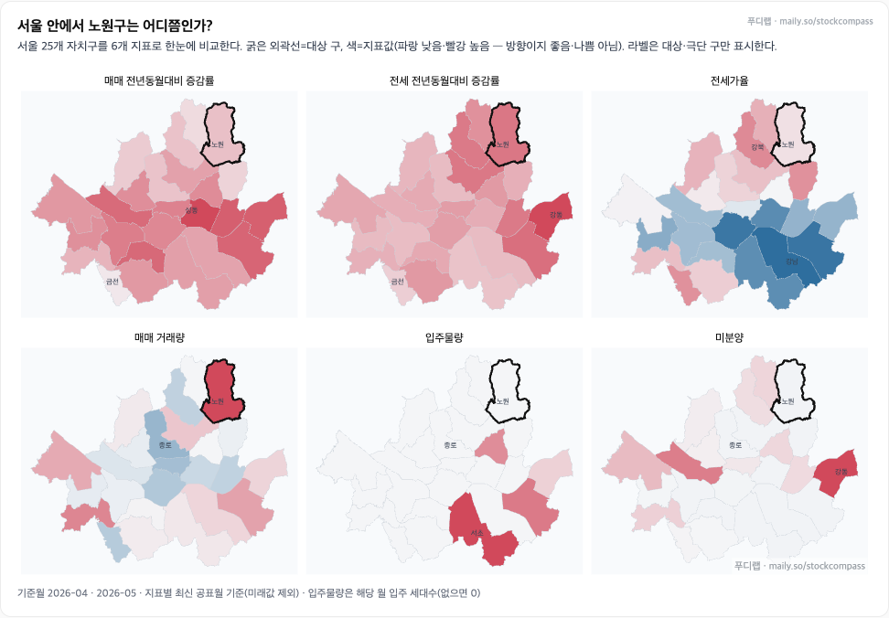
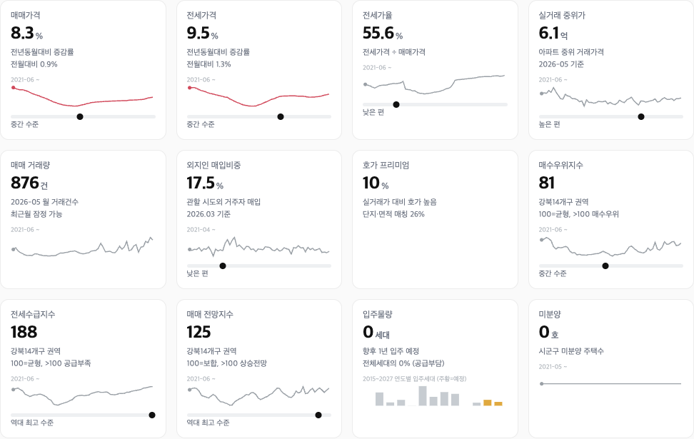
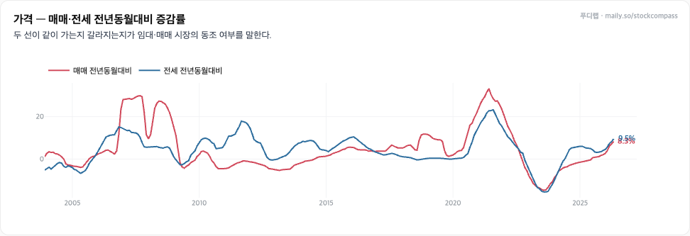
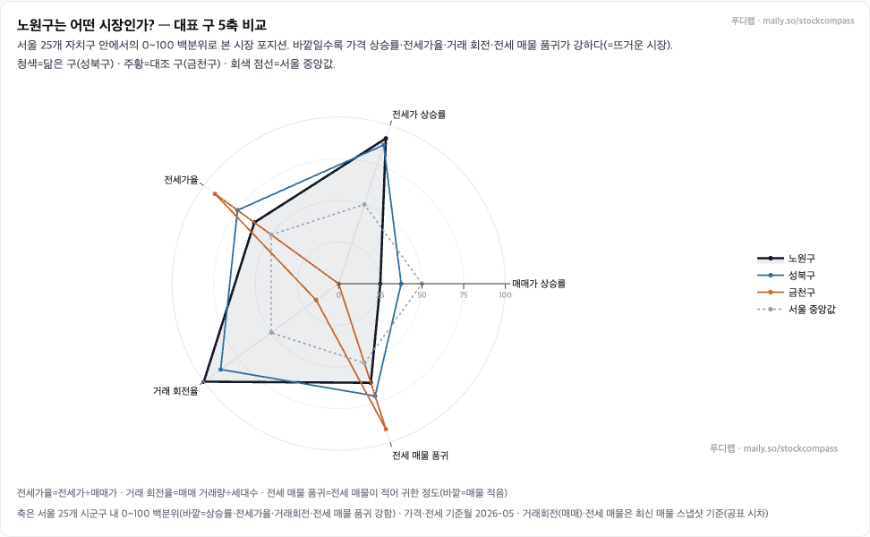
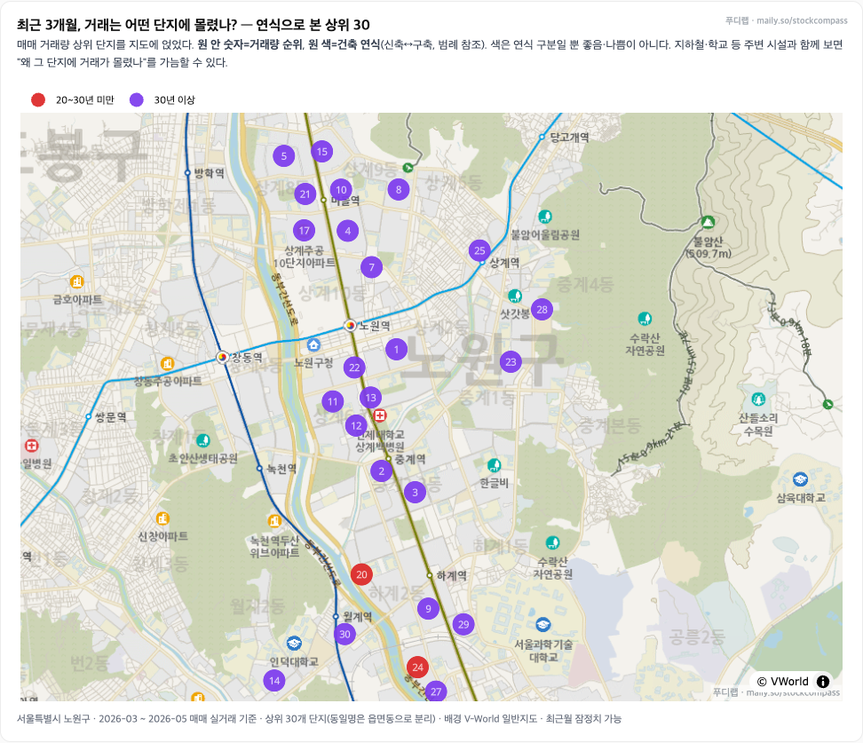

# 노원구 부동산 데이터 분석 대시보드

가격·거래·전세·공급·정책·입지 신호를 지역 진단부터 단지 분석까지 한 흐름으로 구성한 실제 대시보드 사례입니다.

화면에 표시된 `푸디랩`과 `투자 나침반`은 푸디가 운영한 프로젝트 브랜드입니다.

[← 푸디 프로필로 돌아가기](../README.md)

## 1. 지역 종합 진단

서로 다른 시장 신호를 한 문장 진단과 압력 지도로 요약하고, 노원구의 현재 위치를 빠르게 파악할 수 있도록 구성했습니다.

## 2. 서울 지역 비교

서울 25개 자치구의 매매·전세 가격, 전세가율, 거래량, 입주물량, 미분양을 같은 화면에서 비교합니다.

## 3. KPI와 가격·거래 흐름

가격, 거래, 전세, 수급, 공급 지표를 같은 기준월의 KPI로 모아 시장 상태를 한눈에 확인합니다.

매매와 전세의 장기 증감률을 함께 놓아 두 흐름이 같이 움직이는지, 서로 갈라지는지를 살펴봅니다.

## 4. 다차원 비교

가격 상승, 전세 상승, 전세가율, 거래 회전, 전세 매물 품귀를 0~100 범위로 환산해 대표 지역과 노원구의 시장 특성을 비교합니다.

## 5. 공간·단지 분석

최근 3개월 실거래가 집중된 단지를 지도에 배치하고 거래 순위와 연식을 함께 표시해, 거래가 모인 위치를 공간적으로 확인합니다.

## 6. 데이터 기준

- 분석 대상: 서울특별시 노원구 아파트 시장
- 기준월: 2026년 5월
- 데이터 스냅샷: 2026년 7월 6일
- 비교 범위: 서울 25개 자치구, 노원구 동·단지
- 거래 지도: 2026년 3월부터 5월까지의 매매 실거래 상위 30개 단지
- 주요 데이터: 국토교통부 아파트 실거래가, KB 가격지수·심리, 네이버 매물·단지, KOSIS 미분양·매입자 거주지, 금리·대출 등 거시지표, 규제지역·토지거래허가구역
