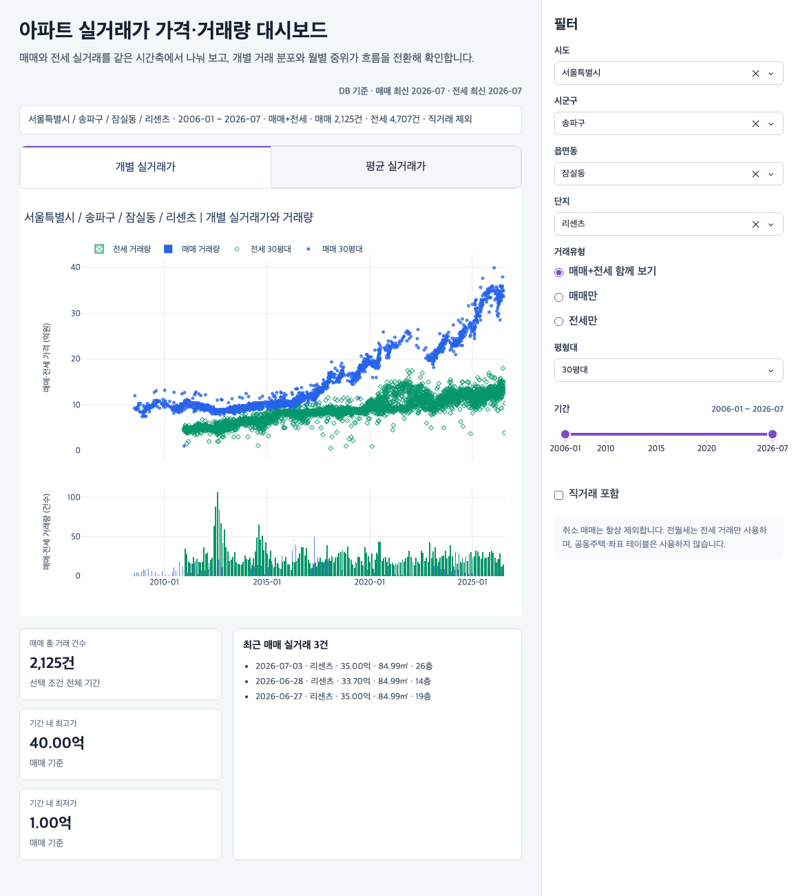

# 부동산 분석 대시보드 모음

부동산 데이터를 지역·단지·평형·기간별로 탐색하고, 가격 변화와 거래 흐름을 비교하기 위해 만든 대시보드입니다.

[← 푸디 프로필로 돌아가기](../README.md)

## 1. 아파트 실거래가 가격·거래량 대시보드

매매와 전세 실거래를 같은 시간축에 놓고 개별 거래 분포와 월별 거래량을 함께 확인합니다. 지역, 단지, 평형대, 거래유형, 기간을 바꾸면 차트와 요약 지표가 같은 조건으로 갱신됩니다.

  

- **화면 구성:** 개별 매매·전세 가격 분포, 월별 거래량, 기간 요약 지표, 최근 실거래
- **탐색 조건:** 시도·시군구·읍면동·단지, 거래유형, 평형대, 기간, 직거래 포함 여부
- **기본 화면:** 서울특별시 송파구 잠실동 리센츠, 30평대, 매매·전세
- **구현:** DuckDB의 실거래 데이터를 읽고 선택 조건에 따라 차트와 지표를 갱신하는 Dash 애플리케이션
